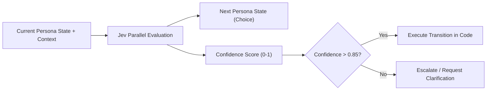

# Cookbook: Autonomous Persona State Routing with Jev

> **Problem**: LLM agent loops frequently hallucinate or drift when attempting to navigate complex multi-stage persona states (e.g. `Prospecting` -> `ObjectionHandling` -> `EscrowClosing` -> `SupportHandoff`). Chat-based prompts take seconds and produce variable output.
>
> **Solution**: Model the persona as a deterministic state machine where transitions are decided by parallel Jev `Choice` and `Score` questions in < 250ms.

---

## Architecture



---

## Implementation (Python)

```python
from typesafe_sdk import TypeSafeClient, Choice, Score

client = TypeSafeClient()

# 1. Define current conversation and persona context
state = {
    "persona_name": "Marcus (SaaS Advisory Persona)",
    "current_stage": "ObjectionHandling",
    "lead_tier": "Enterprise",
    "last_user_message": "Your pricing seems steep compared to basic scrapers.",
    "pricing_objection_handled": False,
    "conversation_turns": 4
}

# 2. Evaluate discrete next stage and objection severity in parallel
response = client.evaluate(
    state=state,
    questions=[
        Choice(
            id="next_stage",
            description="Given the conversation state, what is the exact next persona stage to transition to?",
            options=[
                "ClarifyValueProp",
                "OfferEnterpriseTierTrial",
                "DisqualifyLead",
                "EscalateToHumanSales"
            ]
        ),
        Score(
            id="objection_intensity",
            description="Rate the severity of the user's pricing objection from 1 (mild curiosity) to 5 (hard deal-breaker)."
        )
    ]
)

# 3. Branch deterministically in code
next_stage = response["next_stage"].choice
confidence = response["next_stage"].confidence
intensity = response["objection_intensity"].score

print(f"Target Stage: {next_stage} (Confidence: {confidence:.2f})")
print(f"Objection Intensity: {intensity}/5")

if confidence >= 0.85:
    if intensity >= 4:
        # Route to high-touch enterprise concession
        transition_to("OfferEnterpriseTierTrial")
    else:
        transition_to(next_stage)
else:
    # Confidence too low: fallback to conservative value clarification
    transition_to("ClarifyValueProp")
```

---

## Why this wins over Pure LLM Chat
1. **0% Schema Failure**: Jev outputs typed enum values directly usable in code.
2. **Predictable Latency**: Evaluations run server-side in parallel against logits.
3. **Audit Trail**: Every state transition includes calibrated probabilities logged to your database.
